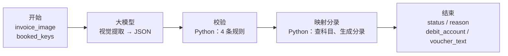
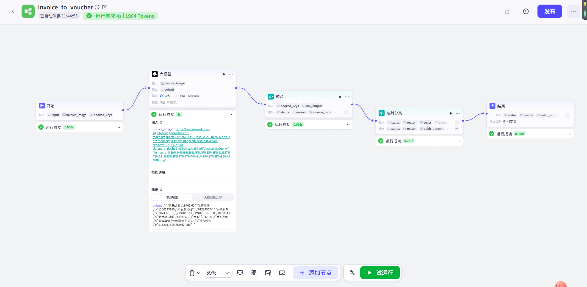
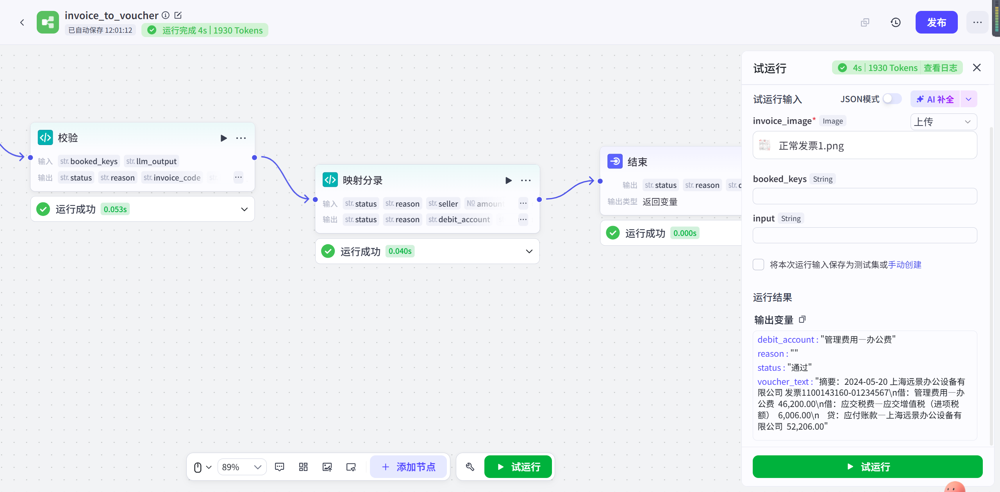
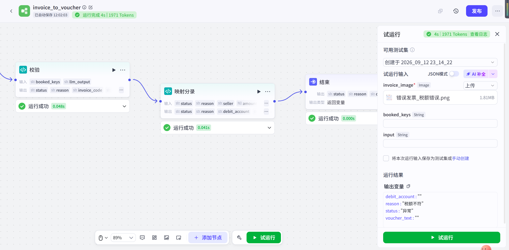

# invoice_to_voucher：增值税发票 → 记账凭证 的 AI 自动化工作流

> 用扣子（Coze）低代码平台搭建的端到端财务流程：视觉大模型读取发票 → Python 代码节点执行会计校验 → 供应商映射表决定科目 → 自动生成三行分录。异常票不生成分录，路由至人工复核。
>
> **设计原则：AI 负责提取，规则由会计编写，判断留给人。**

---

## 1. 这个项目解决什么问题

进项发票入账是财务部门最重复的工作之一：从票面抄字段、核对金额与税率、判断科目、录入凭证。其中"抄字段"适合交给模型，"核对"和"判断科目"不适合——模型的输出不稳定，且错了自己不知道。

本项目把这三步拆开：

| 步骤 | 谁来做 | 为什么 |
|---|---|---|
| 读取票面 10 个字段 | 视觉大模型（豆包 1.5 Pro 视觉理解） | 版式多样、水印噪声，模型比规则更擅长 |
| 4 条会计校验 | Python 代码节点 | 必须 100% 确定，不能靠概率 |
| 借方科目 | 供应商→科目映射表 | 同一供应商永远记同一科目，可审计、可维护 |
| 异常处理 | 人 | 校验不通过的票进异常清单，由会计决定 |

## 2. 工作流结构





### 节点说明

**开始**：输入一张发票图片；`booked_keys` 为已入账发票清单（"发票代码-号码"，逗号分隔），供重复检测使用。

**大模型（提取）**：系统提示词定义 10 个字段与 7 条提取规则（取合计行而非明细行、保留发票号码前导零、忽略水印和印章、无法辨认填 null 而不猜）；用户提示词只传入图片。输出为 JSON 字符串。完整提示词见 [`prompts/extract_system_prompt.md`](prompts/extract_system_prompt.md)。

**校验（代码节点）**：解析 JSON 后执行 4 条规则，任一不通过则 `status=异常`，`reason` 取固定短语：

| 规则 | 逻辑 | reason |
|---|---|---|
| 1 | \|金额 × 税率 − 税额\| < 0.01 | 税额不符 |
| 2 | \|金额 + 税额 − 价税合计\| < 0.01 | 价税合计不符 |
| 3 | 税率 ∈ {13, 9, 6, 5, 3, 1, 0} | 税率非法 |
| 4 | "发票代码-号码" 不在已入账清单中 | 号码重复 |

设计细节：容差取 0.01 而不是相等，因为票面税额四舍五入到分（例：84,905.66 × 6% = 5,094.3396，票面 5,094.34）；税率非法时不再比对税额，避免同一张票报两条互相矛盾的原因；关键字段缺失时直接判异常，不让 null 流向下游。代码见 [`code/validate.py`](code/validate.py)。

**映射分录（代码节点）**：`status=通过` 的票按销方名称查映射表得借方科目，生成三行分录；查不到的供应商报"供应商未映射"；校验已异常的票原样放行、不生成分录。进项税额与应付账款科目固定。代码见 [`code/map_and_post.py`](code/map_and_post.py)。

```
摘要：2024-05-20 上海远景办公设备有限公司 发票1100143160-01234567
借：管理费用—办公费  46,200.00
借：应交税费—应交增值税（进项税额）  6,006.00
    贷：应付账款—上海远景办公设备有限公司  52,206.00
```

## 3. 样例数据

15 张自制的增值税专用发票图片（`data/invoices/`），全部带"教学示例 / 不可报销"水印，购买方固定为虚构公司"北京星云科技有限公司"，销售方 14 家虚构公司覆盖 13% / 9% / 6% 三档税率、单行与多行明细。

| 类型 | 张数 | 说明 |
|---|---|---|
| 正常票 | 10 | 其中 1 张轻度旋转 + 阴影，测提取鲁棒性 |
| 税额 ≠ 金额 × 税率 | 1 | 触发规则 1 |
| 价税合计 ≠ 金额 + 税额 | 1 | 触发规则 2 |
| 税率 12% | 1 | 触发规则 3 |
| 发票号码与已入账票重复 | 1 | 触发规则 4 |

每张票的真实字段值记录在 `data/answer_sheet.xlsx`，供准确率计算；供应商映射表见 `data/supplier_mapping.xlsx`。

> 不使用任何真实发票。所有公司名称、税号、账号均为虚构。

## 4. 测试结果

15 张全量测试（`tests/test_results.xlsx`）：

| 指标 | 结果 |
|---|---|
| 字段提取准确率 | 150 / 150（10 字段 × 15 张） |
| 错票拦截率 | 4 / 4 |
| 正常票误拦 | 0 |
| 单张耗时 / Token | 约 4 秒 / 约 1,950 tokens |

产出示例见 `output/输出示例_分录台账与异常清单.xlsx`：11 张通过票生成 33 行分录，借贷合计平衡；4 张异常票进入异常清单，标注原因，等待人工复核。




## 5. 局限与下一步

这些数字来自小样本、干净版式，不能外推：

- 样本为 15 张自制教学发票，噪声只有水印和 1 张轻度旋转；真实拍摄件的褶皱、反光、手写、电子发票 PDF 均未测试。
- 每张错票只含一处错误；多错叠加、字段缺失、购买方非本公司等场景未覆盖。
- 已入账清单以输入变量模拟，生产环境应改为数据库查询。
- 供应商映射表内置在代码节点中，新增供应商需手工维护；生产环境应改为数据库或知识库。
- 台账由 15 次运行结果汇总生成；工作流本身输出结构化变量，未直连 ERP。

下一步优先级：接扣子数据库节点做入账清单与台账持久化 → 增加"购买方 ≠ 本公司"校验 → 用循环节点支持批量上传。

## 6. 仓库结构

```
invoice_to_voucher/
├── README.md
├── prompts/
│   └── extract_system_prompt.md   # 提取节点系统提示词全文
├── code/
│   ├── validate.py                # 校验节点代码
│   └── map_and_post.py            # 映射分录节点代码
├── data/
│   ├── invoices/                  # 15 张样例发票图片
│   ├── answer_sheet.xlsx          # 答案表（真实字段值）
│   └── supplier_mapping.xlsx      # 供应商→科目映射表
├── tests/
│   └── test_results.xlsx          # 15 张全量测试记录与指标
├── output/
│   └── sample_ledger_and_exceptions.xlsx
└── docs/
    ├── demo.mp4                   # 2 分钟演示视频
    └── screenshots/               # 各节点配置与运行结果截图
```

## 7. 复现

1. 登录 [coze.cn](https://www.coze.cn) 低代码开发平台（个人空间 → 资源库 → 创建工作流）。
2. 按第 2 节搭建 5 个节点；大模型节点选择带视觉理解能力的模型，图片通过"视觉理解输入"引用。
3. 两个代码节点语言选 Python，粘贴 `code/` 下的代码，按代码返回值配置输出变量。
4. 试运行时上传 `data/invoices/` 中任意一张；测试"号码重复"时在 `booked_keys` 填入 `1100143160-01234567`。

---

## Project Summary (English)

**invoice_to_voucher** is an end-to-end finance automation workflow built on Coze (ByteDance's low-code agent platform). It reads a Chinese VAT invoice image with a vision LLM, validates the extracted fields with four accounting rules implemented in Python, looks up the debit account from a supplier-to-account mapping table, and generates a balanced three-line journal entry. Invoices that fail validation are routed to an exception list for human review instead of being posted.

The design principle is a strict separation of roles: the model extracts, code validates, a maintained table decides the account, and a person handles exceptions. On 15 self-made synthetic invoices (10 valid, 4 with one deliberate error each, 1 rotated/shadowed), the workflow extracted 150/150 fields correctly, intercepted 4/4 error invoices, and produced zero false interceptions. Limitations — small clean sample, single-error cases only, simulated booked-invoice list, code-embedded mapping — are documented above, along with the next steps toward a production-grade version.

Skills demonstrated: prompt design for structured extraction, Python validation logic with accounting domain rules, low-code workflow orchestration, test design with a ground-truth answer sheet.
